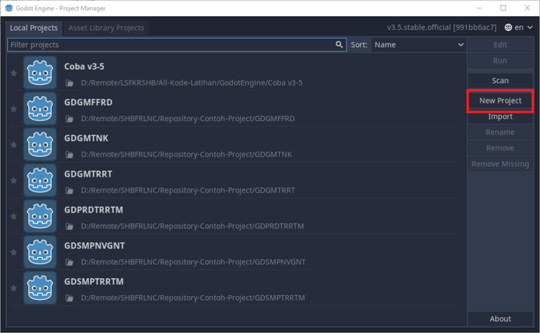
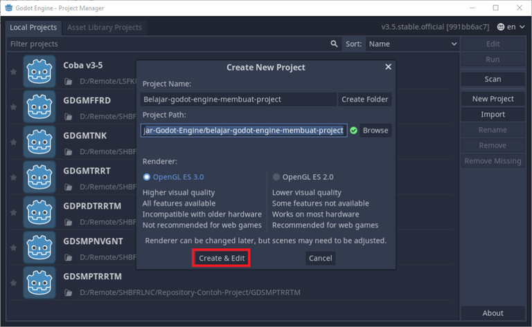
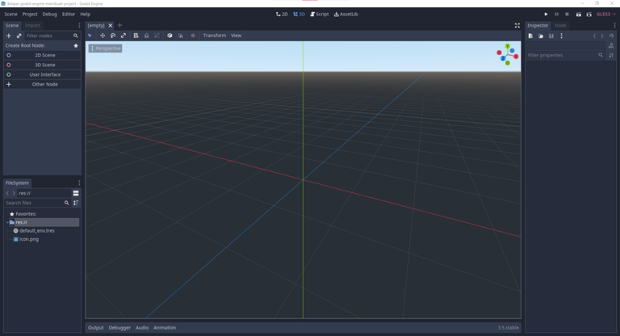
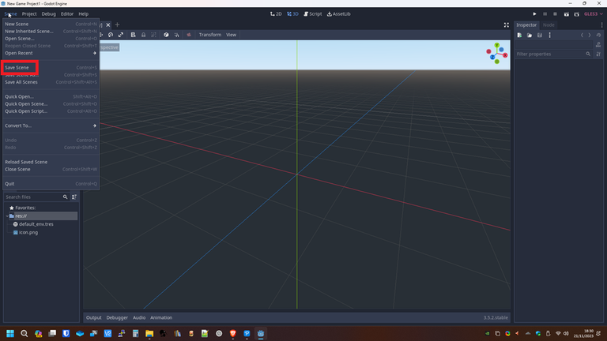
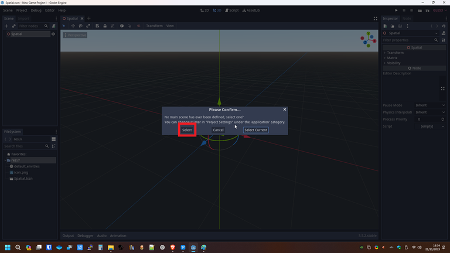
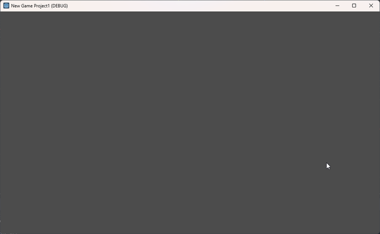

# Belajar Godot Engine 3 Cara Membuat Project

## Source Code Project Ini

https://github.com/rakifsul/belajar_coding_godot_3/tree/main/contoh_godot3_create

## Pendahuluan

Membuat game dari nol dan hanya dengan coding saja adalah hal yang relatif sulit.

Agar pembuatan game menjadi lebih mudah, manusia menciptakan sebuah tool yang bernama game engine.

Game engine ada banyak jenisnya.

Ada Panda 3D, Unreal Engine, Unity, dan lain-lain.

Dilihat dari lisensinya, game engine ada yang bersifat proprietary dan open source.

Salah satu game engine open source yang cukup terkenal adalah Godot Engine.

Godot Engine adalah game engine open source yang bisa digunakan secara gratis.

Mindset yang ada pada game engine ini adalah bahwa semua yang tampil di dalam game adalah scene.

Jadi, karakter, obstacle, GUI, ground, wall, trigger dan lain-lain dianggap sebagai scene.

Berbeda dengan Unity yang menganggapnya sebagai Game Object yang ditempeli Component.

Namun, saya sendiri seringkali mengategorikan scene-scene tadi sebagai scene dan prefab, walaupun pada hakikatnya itu semua adalah scene. Tapi itu untuk memudahkan pengelompokannya saja.

Saat ini Godot Engine sudah mencapai versi 4, tapi yang LTS adalah versi 3.

Oleh karena itu, tidak ada salahnya jika saya membahasnya di blog ini.

Sekarang, sebelum melangkah lebih lanjut, mari kita pelajari cara membuat project di Godot Engine 3 ini.

## Lebih Lanjut tentang Godot Engine 3

Godot Engine 3 adalah sebuah platform pengembangan permainan yang gratis dan open-source yang memungkinkan para pengembang untuk membuat berbagai jenis permainan, termasuk permainan 2D dan 3D, tanpa biaya lisensi.

Berikut adalah beberapa poin penting tentang Godot Engine 3:

Gratis dan Open-Source: Godot Engine 3 tersedia secara gratis dan sepenuhnya open-source, yang berarti siapa pun dapat mengunduh, menggunakan, dan memodifikasinya tanpa biaya. Ini membuatnya sangat menarik bagi pengembang independen dan proyek dengan anggaran terbatas.

Lingkungan Pengembangan Terintegrasi (IDE): Godot dilengkapi dengan lingkungan pengembangan terintegrasi yang kuat (IDE) yang memungkinkan pengembang untuk membuat, mengedit, dan mengatur proyek mereka dengan mudah. IDE menyediakan alat untuk membuat scene, skrip, UI, animasi, dan masih banyak lagi.

Dukungan untuk Bahasa Skrip Multipel: Godot mendukung beberapa bahasa pemrograman skrip termasuk GDScript (bahasa pemrograman khusus Godot), C#, dan VisualScript (antarmuka pengembangan permainan berbasis node). Ini memberikan fleksibilitas bagi pengembang untuk memilih bahasa pemrograman yang paling sesuai dengan kebutuhan proyek mereka.

Grafis dan Audio: Godot memiliki dukungan yang kuat untuk grafis 2D dan 3D, termasuk fitur-fitur seperti shaders, pencahayaan, animasi, partikel, dan lainnya. Ini memungkinkan untuk membuat permainan dengan tampilan visual yang menarik. Selain itu, Godot juga menyediakan fitur audio yang lengkap untuk memungkinkan pengembang membuat dan mengatur efek suara dan musik dalam permainan mereka.

Cross-Platform: Permainan yang dikembangkan menggunakan Godot dapat diterapkan ke berbagai platform, termasuk PC, Mac, Linux, Android, iOS, dan bahkan konsol seperti Nintendo Switch. Ini memberikan kesempatan bagi pengembang untuk menjangkau pemain di berbagai perangkat.

Komunitas yang Aktif: Godot memiliki komunitas pengembang yang besar dan aktif yang terlibat dalam berbagi pengetahuan, memberikan dukungan, dan berkolaborasi dalam pengembangan proyek. Forum, grup Discord, dan dokumentasi resmi merupakan sumber daya yang sangat berharga bagi pengembang yang menggunakan Godot.

Pengembangan Berkelanjutan: Godot terus berkembang dan diperbarui secara berkala dengan peningkatan fitur baru, peningkatan kinerja, dan perbaikan bug. Tim pengembang dan kontributor komunitas terus bekerja keras untuk menjaga Godot tetap relevan dan kompetitif di pasar pengembangan permainan.

Secara keseluruhan, Godot Engine 3 adalah platform pengembangan permainan yang kuat, fleksibel, dan ramah pengembang yang memungkinkan pengembang untuk mewujudkan ide-ide kreatif mereka dalam bentuk permainan yang menarik dan inovatif.

## Tujuan

Tujuan dari tutorial ini adalah:

-   Memahami dan mampu mempraktekan cara membuat project Godot Engine 3.
-   Mampu mencoba menjalankan atau mencoba scene setelah project itu dibuat.

## Prasyarat

Prasyarat dari tutorial ini adalah:

-   Menggunakan sistem operasi Windows 10 ke atas.
-   Menggunakan komputer yang bisa menjalankan Godot Engine 3 dengan normal.
-   Telah men-download Godot Engine 3 dan mengekstraknya.
-   Mampu menjalankan executable dari Godot Engine 3 yang telah diekstrak.

## Langkah-Langkah

Pertama-tama, jalankan executable dari Godot Engine 3 yang telah di-download dan diekstrak ke komputer Anda.

Setelah executable berjalan, Anda akan melihat tampilan ini:

Untuk membuat project baru, klik "New Project".

Nanti tampilannya akan menjadi seperti ini:

Selanjutnya, beri nama project di "Project Name" dan "Browse" untuk memilih tempat menyimpan projectnya.

Selanjutnya, klik "Create & Edit".

Nanti tampilannya akan berubah menjadi seperti ini:

Sekarang klik tombol "3D Scene", kemudian buka menu "Scene" > "Save Scene" dan save di manapun.

Sekarang, tekan tombol play di pojok kanan atas.

Nanti akan tampil prompt seperti ini:

Klik "Select" kemudian ambil scene yang barusan di-save.

Nanti akan muncul game window seperti ini:

Selesai.

## Penutup

Sekarang, Anda telah berhasil membuat project Godot Engine 3 dan mencobanya.

Ada baiknya jika Anda coba sendiri cara membuka project yang telah Anda buat tadi.
