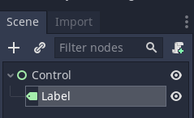
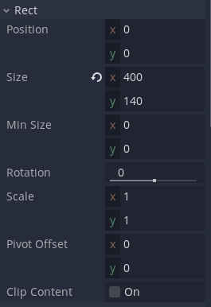
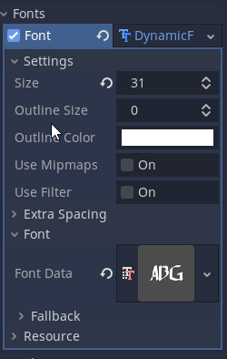
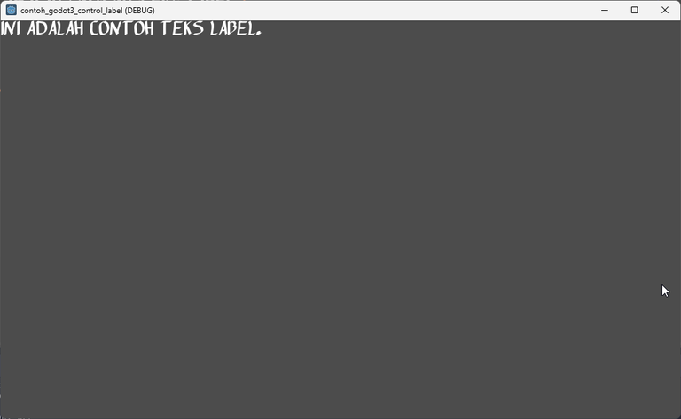

# Belajar Godot Engine 3 Membuat Label Dengan Custom Font

## Source Code Project Ini

https://github.com/rakifsul/belajar_coding_godot_3/tree/main/contoh_godot3_control_label

## Pendahuluan

Seringkali pada game, terdapat objek tulisan entah itu untuk judul, help, atau yang lainnya.

Untuk membuat teks semacam itu di Godot Engine 3, Label Node bisa digunakan.

Bagaimana caranya? Mari kita coba.

## Lebih Lanjut tentang Label Node

Label Node di Godot Engine 3 adalah salah satu jenis Node yang digunakan untuk menampilkan teks dalam sebuah permainan atau aplikasi.

Node ini memungkinkan pengembang untuk menampilkan teks statis atau teks yang diperbarui secara dinamis selama permainan berlangsung.

Berikut beberapa informasi penting tentang Label Node di Godot Engine 3:

Menampilkan Teks: Label Node digunakan untuk menampilkan teks pada layar permainan. Teks tersebut bisa berupa pesan, skor, judul, instruksi, dan lain sebagainya.

Kustomisasi Teks: Pengembang dapat mengatur berbagai properti teks seperti font, ukuran, warna, efek bayangan, dan perataan teks.

Multibahasa: Godot mendukung multibahasa, yang berarti Anda dapat menggunakan Label Node untuk menampilkan teks dalam berbagai bahasa dengan mudah.

Dinamis: Anda dapat memperbarui teks yang ditampilkan oleh Label Node secara dinamis selama permainan berlangsung. Misalnya, untuk menampilkan skor saat permainan berlangsung atau menampilkan pesan berdasarkan interaksi pengguna.

Interaksi: Label Node juga dapat dijadikan interaktif dengan menambahkan script yang merespons aksi pengguna, seperti mouse enter atau mouse exit.

Dengan Label Node, pengembang dapat dengan mudah menambahkan teks ke dalam permainan mereka dan menyesuaikannya sesuai kebutuhan, baik itu untuk tujuan estetika, informasi, atau interaksi dengan pengguna.

## Tujuan

Tujuan dari tutorial ini adalah:

-   Pembaca mengenal Label Node.
-   Pembaca mampu mencoba menggunakan Label Node dengan custom font.

## Prasyarat

Prasyarat dari tutorial ini adalah:

-   Menggunakan Godot Engine 3
-   Pernah coding sebelumnya
-   Mengetahui dasar-dasar Godot Engine 3.

## Langkah-Langkah

Pertama, buatlah project baru.

Caranya telah dibahas di sini.

Selanjutnya, buat scene baru bernama "Control.tscn" dengan root Control Node.

Selanjutnya, buat Label Node di bawah Control Node tersebut:

Di inspector Label Node, buka Rect dan isi seperti ini:

Di Inspector tadi, isi Text dengan: "ini adalah contoh teks label.".

Selanjutnya, download font apapun yang berformat .otf.

Masukkan font tersebut ke dalam project folder dengan cara drag and drop.

Di inspector Label Node bagian Fonts, buat New DynamicFont.

Load font tadi melalui inspector di bagian ini, kemudian ubah size nya menjadi 31:

Jadikan Control.tscn sebagai scene default, kemudian jalankan.

Hasilnya seperti ini:

Kira-kira demikian.

## Pembahasan

Tidak ada pembahasan yang diperlukan di artikel ini.

## Penutup

Saya kira cukup sekian.

Jika Anda ingin menggunakan font yang sama dengan saya, file .otf nya ada di folder source code yang disediakan.
