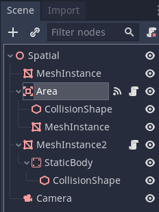
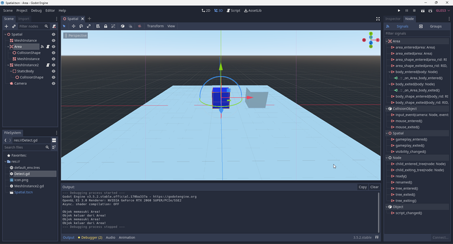

# Belajar Godot Engine 3 Mengenal Area Node

## Source Code Project Ini

https://github.com/rakifsul/belajar_coding_godot_3/tree/main/contoh_godot3_area_node

## Pendahuluan

Di dalam game, ada kalanya sebuah objek perlu dideteksi sentuhannya jika kontak dengan objek lain.

Jika tidak ada efek fisik tingkat lanjut yang dibutuhkan, kita bisa menggunakan Area Node.

Area Node itu sendiri bisa mendeteksi Static Body Node.

Bagaimana caranya? Mari kita coba.

## Lebih Lanjut tentang Area Node

Area Node adalah salah satu jenis node yang digunakan dalam Godot Engine untuk mendeteksi interaksi antara objek dalam game.

Berikut adalah beberapa informasi yang umum diketahui tentang Area Node:

Collision Detection: Node Area digunakan untuk mendeteksi collision atau benturan antara objek lain dalam game. Ini memungkinkan untuk mengetahui kapan objek memasuki, berada di dalam, atau meninggalkan area tertentu dalam scene.

Bentuk dan Ukuran: Area Node dapat memiliki bentuk dan ukuran yang beragam, termasuk kotak, bola, silinder, atau bentuk kustom lainnya. Anda dapat menyesuaikan bentuk dan ukuran Area Node sesuai dengan kebutuhan game Anda.

Interaksi dengan Objek: Ketika objek lain dalam game bersentuhan dengan Area Node, event tertentu dipicu. Anda dapat menambahkan logika dalam skrip yang terhubung ke Area Node untuk menangani tindakan yang diperlukan saat benturan terjadi, seperti memicu efek suara, mengubah properti objek, atau memulai animasi.

Layer Collision dan Mask: Area Node dapat dikonfigurasi dengan layer collision dan mask. Ini memungkinkan Anda untuk mengontrol objek mana yang dapat berinteraksi dengan Area Node. Anda dapat mengatur layer collision dan mask untuk menyesuaikan deteksi collision sesuai kebutuhan.

Digunakan untuk Berbagai Tujuan: Area Node digunakan dalam berbagai jenis game dan untuk berbagai tujuan, termasuk deteksi area dalam game puzzle, sensor dalam game simulasi, zona aman atau zona bahaya dalam game aksi, dan banyak lagi.

Fleksibilitas dan Kustomisasi: Area Node memiliki fleksibilitas yang tinggi dan dapat disesuaikan dengan berbagai skenario dalam game Anda. Anda dapat menyesuaikan properti, logika, dan perilaku Area Node sesuai dengan kebutuhan spesifik proyek Anda.

Efisiensi: Area Node biasanya lebih efisien daripada menggunakan collision shape langsung pada objek yang besar atau kompleks. Ini karena Area Node hanya fokus pada deteksi kollision tanpa perlu merender atau memperbarui properti visual dari objek itu sendiri.

Dengan menggunakan Area Node dalam Godot Engine, Anda dapat dengan mudah mendeteksi dan menanggapi interaksi antara objek dalam game Anda, memberikan fleksibilitas dan kontrol yang lebih besar dalam pengembangan game.

## Tujuan

Tujuan dari tutorial ini adalah:

-   Pembaca mengenal Area Node.
-   Pembaca mampu mencoba menggunakan Area Node.

## Prasyarat

Prasyarat dari tutorial ini adalah:

-   Menggunakan Godot Engine 3
-   Pernah coding sebelumnya
-   Mengetahui dasar-dasar Godot Engine 3 untuk 3D.

## Langkah-Langkah

Pertama, buatlah project baru.

Caranya telah dibahas di "[Belajar Godot Engine 3 Cara Membuat Project](https://github.com/rakifsul/belajar_coding_godot_3/tree/main/Belajar-Godot-Engine-3-Cara-Membuat-Project.md)".

Selanjutnya, buat scene baru bernama "Spatial.tscn" dengan root Spatial Node.

Save, kemudian buat hierarki scene seperti ini:



Berikut ini adalah keterangannya:

-   MeshInstance teratas adalah plane. Gunanya sebagai ground.
-   MeshInstance kedua dari atas adalah visualisasi dari Area Node. Warnanya biru.
-   MeshInstance2 adalah visualisasi StaticBody yang akan digunakan untuk menyentuh Area Node. Warnanya abu-abu.
-   Camera untuk melihat isi scene.

Selanjutnya, buat dan susun hingga scene "Spatial.tscn" jadi seperti ini:



Selanjutnya, buat dan attach script di Area Node. Beri nama Detect.gd. Kemudian hubungkan dengan signal:

-   body_entered
-   body_exited

Selanjutnya, isi dengan kode ini:

```
extends Area

func _on_Area_body_entered(body):
	print("Objek memasuki Area!")


func _on_Area_body_exited(body):
	print("Objek keluar dari Area!")
```

Selanjutnya, buat dan attach script di MeshInstance2 Node. Beri nama MeshInstance2.gd. Kemudian isi dengan kode ini:

```
# extend dari MeshInstance
extends MeshInstance

# abaikan
func _ready():
	pass

# setiap frame
func _process(delta):
	if Input.is_key_pressed(KEY_A):
		# jika key a ditekan, jalankan ke kiri
		self.translate(Vector3(-1,0,0) *  delta * 10)

	if Input.is_key_pressed(KEY_D):
		# jika key d ditekan, jalankan ke kanan
		self.translate(Vector3(1,0,0) *  delta * 10)
```

Agar Camera dalam game visualisasinya sama dengan di Editor, maka sorot Camera Node, kemudian ke menu "Perspective" > "Align Transform with View" saat Camera di editor arahnya sudah tepat.

Save Scene.tscn, kemudian jalankan. Pastikan scene tersebut dipilih sebagai scene utama.

Nanti jika Anda menekan key A, maka kotak abu-abu akan bergerak ke kiri.

Jika Anda menekan key D, maka kotak abu-abu akan bergerak ke kanan.

Jika kedua kotak bersentuhan, maka akan ada log di bagian console dari Game Engine.

## Pembahasan

Sekarang, saya bahas dulu script "MeshInstance2.gd".

Kode ini adalah contoh sederhana dari sebuah skrip dalam Godot Engine yang digunakan untuk menggerakkan objek secara horizontal (kiri dan kanan) menggunakan input dari keyboard. Mari kita bahas baris per baris:

```
# extend dari MeshInstance
extends MeshInstance
```

Baris setelah komentar mengindikasikan bahwa skrip ini adalah turunan (extends) dari kelas MeshInstance. Ini berarti bahwa skrip ini diperuntukkan untuk digunakan pada objek yang merupakan turunan dari kelas MeshInstance, misalnya objek yang memiliki mesh untuk dirender.

```
# abaikan
func _ready():
    pass
```

Fungsi \_ready() adalah salah satu fungsi bawaan yang dipanggil oleh Godot ketika objek sudah siap dan dapat digunakan. Dalam contoh ini, fungsi ini diabaikan karena tidak ada kode yang harus dieksekusi ketika objek sudah siap.

```
# setiap frame
func _process(delta):
```

Fungsi \_process(delta) adalah fungsi lain yang dipanggil oleh Godot setiap frame. Delta adalah parameter yang mewakili waktu yang telah berlalu sejak frame terakhir. Dalam fungsi ini, kode yang ada akan dieksekusi setiap frame.

```
if Input.is_key_pressed(KEY_A):
    # jika key a ditekan, jalankan ke kiri
    self.translate(Vector3(-1,0,0) *  delta * 10)
```

Pada bagian ini, kita menggunakan Input.is*key_pressed(KEY_A)untuk mengecek apakah tombol A ditekan. Jika iya, kita menggunakan self.translate(Vector3(-1,0,0) * delta \_ 10) untuk menggerakkan objek ke kiri. Vector3(-1,0,0) adalah vektor yang menunjukkan arah gerakan ke kiri. Kita mengalikan vektor tersebut dengan delta \* 10 untuk mengatur kecepatan gerakan objek.

```
if Input.is_key_pressed(KEY_D):
    # jika key d ditekan, jalankan ke kanan
    self.translate(Vector3(1,0,0) *  delta * 10)
```

Pada bagian ini, kita menggunakan Input.is*key_pressed(KEY_D) untuk mengecek apakah tombol D ditekan. Jika iya, kita menggunakan self.translate(Vector3(1,0,0) * delta \_ 10) untuk menggerakkan objek ke kanan. Vector3(1,0,0) adalah vektor yang menunjukkan arah gerakan ke kanan. Kita mengalikan vektor tersebut dengan delta \* 10 untuk mengatur kecepatan gerakan objek.

Dengan demikian, skrip ini menggerakkan objek ke kiri atau ke kanan sesuai dengan input dari tombol keyboard yang ditekan, dengan kecepatan yang ditentukan oleh delta \* 10.

Sekarang, saya akan membahas script Detect.gd:

```
extends Area

func _on_Area_body_entered(body):
	print("Objek memasuki Area!")


func _on_Area_body_exited(body):
	print("Objek keluar dari Area!")
```

Pada dasarnya, kedua event handler di atas terjadi jika kotak abu-abu memasuki atau keluar zona kotak biru.

Kalimat pada fungsi print cukup menjelaskannya.

## Penutup

Saya kira cukup sekian.

Sisanya coba saja sendiri.
