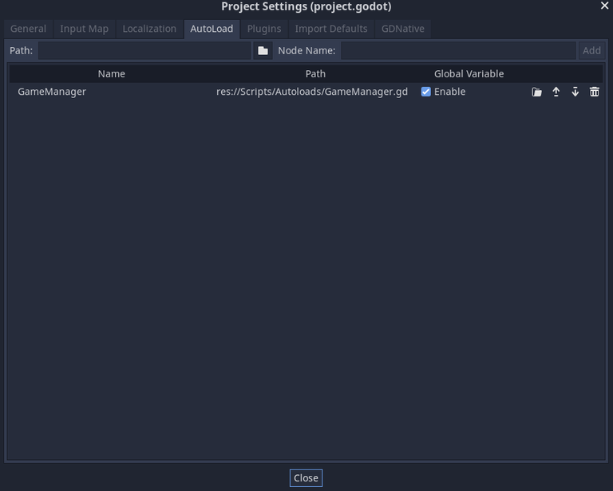

# Belajar Godot Engine 3 Mengenal Autoload

## Source Code Project Ini

https://github.com/rakifsul/belajar_coding_godot_3/tree/main/contoh_godot3_autoload

## Pendahuluan

Autoload adalah fitur Godot Engine 3 yang memungkinkan kita untuk meload script tertentu pada saat game dimulai.

Selain itu, script yang diload juga bisa dibuat menjadi Singleton, sehingga hanya satu objek dari script tersebut yang dibuat.

Hal tersebut berguna saat kita ingin membuat sebuah Game Manager yang melacak score serta perpindahan level dalam game karena hal itu normalnya hanya membutuhkan satu objek saja.

## Lebih Lanjut tentang Autoload

Godot Engine 3 menyediakan fitur yang disebut "autoload," yang merupakan cara yang efisien untuk memuat dan mengakses skrip, objek, atau variabel secara global dalam seluruh proyek game.

Dalam bagian ini, saya akan menjelaskan autoload dalam Godot Engine 3 tanpa menggunakan kode, dengan fokus pada konsep, implementasi, dan manfaatnya.

### Pengertian Autoload

Autoload dalam Godot Engine 3 adalah mekanisme yang memungkinkan objek atau skrip tertentu diinisialisasi dan diakses secara global tanpa perlu menginstansiasikannya secara manual di setiap adegan atau skrip. Dengan kata lain, autoload memungkinkan elemen-elemen tertentu untuk tetap hidup sepanjang siklus hidup game dan dapat diakses dari mana saja dalam proyek.

### Fungsionalitas Utama Autoload

#### Inisialisasi Global

Autoload memungkinkan objek atau skrip untuk diinisialisasi secara global saat game dimulai. Inisialisasi ini terjadi hanya sekali selama siklus hidup game.

#### Akses Global

Objek atau variabel yang di-autoload dapat diakses dari mana saja dalam proyek tanpa perlu membuat instance baru. Ini menyederhanakan pengelolaan sumber daya dan variabel yang sering digunakan.

#### Pemeliharaan

Autoload membantu dalam pemeliharaan proyek dengan menyediakan cara untuk mengelola elemen-elemen global secara terpusat. Perubahan atau pembaruan hanya perlu dilakukan di satu tempat.

#### Pembuatan Instans Objek Terpusat

Autoload dapat digunakan untuk membuat instance objek tertentu dan menyediakan akses terpusat ke objek tersebut. Ini berguna untuk objek yang dibutuhkan di banyak adegan.

#### Skrip Global

Autoload memungkinkan skrip tertentu menjadi global, memungkinkan fungsi dan variabel yang terkandung di dalamnya dapat diakses dari mana saja tanpa perlu duplikasi.

### Contoh Penggunaan Autoload

#### Autoload untuk Manajemen Game

Anda dapat menggunakan autoload untuk membuat objek yang mengelola keadaan permainan, skor, atau elemen-elemen penting lainnya. Misalnya, autoload yang bertindak sebagai singleton dapat menyimpan dan mengelola informasi seperti skor global.

#### Autoload untuk Pengaturan Game

Autoload dapat digunakan untuk menyimpan pengaturan atau konfigurasi game yang diperlukan di banyak bagian proyek. Misalnya, autoload dapat membawa informasi tentang resolusi layar atau pengaturan audio.

#### Autoload untuk Pemrosesan Data

Jika Anda memiliki objek yang bertanggung jawab atas pemrosesan data tertentu, autoload dapat membuat instance dari objek tersebut secara global. Misalnya, autoload dapat membuat objek yang mengelola data inventaris pemain.

#### Autoload untuk Pengelolaan Audio

Autoload dapat digunakan untuk menciptakan objek pengelola audio yang dapat diakses dari banyak adegan. Objek ini dapat mengelola pemutaran audio di seluruh game.

#### Autoload untuk Sumber Daya Grafis

Jika Anda memiliki sumber daya grafis seperti sprite atau animasi yang digunakan di seluruh game, autoload dapat membantu membuat instance dari objek tersebut agar dapat diakses dari mana saja.

### Manfaat Penggunaan Autoload

#### Sederhana dan Efisien

Autoload menyederhanakan akses global ke objek atau variabel, mengurangi boilerplate code dan menjadikan kode lebih efisien.

#### Pemeliharaan yang Mudah

Dengan autoload, pemeliharaan proyek menjadi lebih mudah karena elemen-elemen global dapat dikelola dan diperbarui dengan sentralitas.

#### Kode yang Bersih

Penggunaan autoload membantu menjaga kode tetap bersih dan terorganisir dengan menghindari duplikasi dan mempromosikan penggunaan singleton.

#### Fleksibilitas dalam Struktur Proyek

Autoload memungkinkan fleksibilitas dalam struktur proyek, memungkinkan elemen-elemen global diakses tanpa terikat pada hierarki adegan.

#### Keseluruhan Pengelolaan

Dengan autoload, elemen-elemen yang dikelola secara global seperti skrip atau objek tertentu dapat diakses dengan mudah dari berbagai bagian proyek, memastikan keseluruhan pengelolaan sumber daya.

Autoload dalam Godot Engine 3 adalah fitur yang kuat untuk membuat elemen-elemen global dalam proyek game.

Dengan menyederhanakan inisialisasi dan akses ke objek atau variabel, autoload membantu mengurangi kompleksitas dan meningkatkan efisiensi pengembangan.

Dengan memahami konsep dan mengimplementasikannya melalui Pengaturan Proyek, pengembang dapat memanfaatkan autoload untuk membuat kode yang bersih, mudah dipelihara, dan efisien dalam pengelolaan sumber daya game.

Dengan demikian, autoload menjadi alat yang berharga dalam mengoptimalkan siklus hidup game dan pengembangan proyek game secara keseluruhan.

## Tujuan

Tujuan dari tutorial ini adalah:

-   Pembaca memahami autoload dan dapat menggunakannya di saat diinginkan.

## Prasyarat

Prasyarat dari tutorial ini adalah;

-   Menggunakan Godot Engine 3
-   Telah mengenal Godot Engine 3 dan mencobanya
-   Pernah coding sebelumnya

## Langkah-Langkah

Script yang digunakan dalam project ini ada 3:

-   GameManager.gd
-   Scene1.gd
-   Scene2.gd

Buatlah script "Scripts/Autoloads/GameManager.gd" dan isi dengan kode ini:

```
# file: GameManager.gd

extends Node # script ini di-extend dari Node

# ketika game baru dijalankan
func _ready():
    print("Game dimulai...")

# ganti scene ke "name"
func change_scene(name):
    # begini perintah untuk ganti scene
    get_tree().change_scene("res://Scenes/" + name + ".tscn")
```

Buatlah "Scripts/Scene1.gd" dan isi dengan kode ini:

```
# file: Scene1.gd

extends Spatial # script ini di-extend dari Spatial

var timer = 0.0 # inisialisasi variabel timer

# ketika game baru dijalankan
func _ready():
    print("Scene1 dimulai...")

# saat game berjalan. delta adalah selisih waktu
func _process(delta):
    timer += delta
    if (timer > 3.0):
        GameManager.change_scene("Scene2") # ganti scene ke Scene2
        timer = 0.0
```

Selanjutnya, buatlah script "Scripts/Scene2.gd" dan isi dengan kode ini:

```
# file: Scene2.gd

extends Spatial # script ini di-extend dari Spatial

# ketika game baru dijalankan
func _ready():
    print("Scene2 dimulai...") # print "Scene2 dimulai..."
```

Game Manager ini didaftarkan pada Project Settings > Autoload sehingga bisa diakses dari script manapun.



Karena sudah didaftarkan tadi, maka "GameManager.gd" tidak perlu di-attach lagi di manapun.

Selanjutnya, buat Scene1 dan Scene2 dari Spatial dan save ke folder "Scenes".

Adapun "Scene1.gd" di-attach ke Spatial bernama Scene1 dan "Scene2.gd" di-attach ke Spatial bernama Scene2.

Selanjutnya, jadikan Spatial yang di-attach script "Scene1.gd" (Scene1) sebagai default Scene atau Scene yang pertama dijalankan.

Jika Anda tidak tahu caranya, cari sendiri.

Jika setup Anda sudah benar, maka saat project di-play, akan muncul teks di console:

```
Scene1 dimulai...
```

Kemudian:

```
Scene2 dimulai...
```

## Pembahasan

"GameManager.gd" tugasnya menjadi API untuk mengganti scene dengan method change_scene:

```
# ganti scene ke "name"
func change_scene(name):
    # begini perintah untuk ganti scene
    get_tree().change_scene("res://Scenes/" + name + ".tscn")
```

Walaupun begitu, bukan script tersebut yang memanggilnya.

Yang memanggilnya adalah "Scene1.gd":

```
# saat game berjalan. delta adalah selisih waktu
func _process(delta):
    timer += delta
    if (timer > 3.0):
        GameManager.change_scene("Scene2") # ganti scene ke Scene2
        timer = 0.0
```

Oleh karena itulah, saya menginstruksikan untuk menjadikan Scene2 sebagai Scene default.

Di Scene 1 ini, teks ini akan muncul di console:

```
Scene1 dimulai...
```

Perhatikan juga bahwa pada kode di atas GameManager memanggil method change_scene dengan parameter "Scene2".

Artinya dia akan membuka Scene2 setelah 3 detik.

Dan setelah Scene2 dibuka maka teks consolenya pun akan muncul:

```
Scene2 dimulai...
```

## Penutup

Sekarang, seharusnya Anda sudah paham apa itu autoload dan cara menggunakannya.

Selanjutnya, silakan terapkan pada latihan project Anda.
