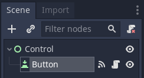
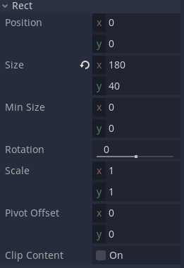
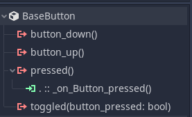
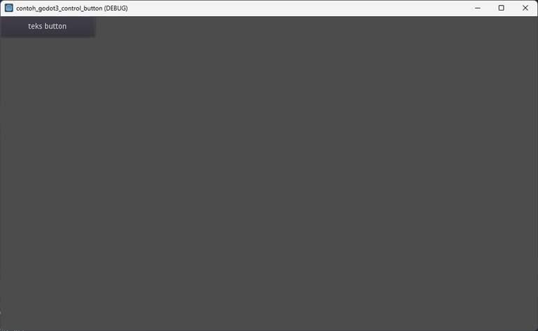

# Belajar Godot Engine 3 Mengenal Button Node

## Source Code Project Ini

https://github.com/rakifsul/belajar_coding_godot_3/tree/main/contoh_godot3_control_button

## Pendahuluan

Untuk menambahkan interaksi dalam game, button atau tombol mungkin bisa digunakan.

Penggunaan button di Godot Engine 3 dilakukan dengan menggunakan Button Node.

Dengan Node tersebut, kita bisa memberikan respons terhadap event pressed nya.

Mari kita coba...

## Lebih Lanjut tentang Button Node

Button Node di Godot Engine 3 adalah salah satu jenis Node yang digunakan untuk membuat tombol interaktif dalam permainan atau aplikasi.

Berikut beberapa informasi penting tentang Button Node di Godot Engine 3:

Interaksi Pengguna: Button Node memungkinkan pengembang untuk membuat elemen UI yang dapat diaktifkan oleh pengguna dengan klik mouse atau sentuhan pada perangkat layar sentuh.

Visualisasi: Button Node dapat memiliki berbagai bentuk dan gaya visual, termasuk teks, gambar, atau kombinasi keduanya. Pengembang dapat menyesuaikan penampilan tombol menggunakan properti seperti warna, font, ukuran, dan efek visual lainnya.

Respon Aksi: Saat pengguna mengklik tombol, Button Node dapat diprogram untuk merespons dengan berbagai aksi, seperti memulai suatu peristiwa dalam permainan, mengubah properti lain dalam permainan, atau memanggil fungsi tertentu.

State Handling: Button Node memiliki kemampuan untuk menangani state berbagai jenis, seperti normal, hover (ketika kursor berada di atas tombol), dan pressed (ketika tombol ditekan). Hal ini memungkinkan pengembang untuk menyesuaikan tampilan tombol sesuai dengan keadaannya.

Event Handling: Godot menyediakan berbagai event yang terkait dengan Button Node, seperti "pressed", yang dapat digunakan untuk menanggapi interaksi pengguna dengan tombol.

Scripting: Button Node dapat diberikan skrip untuk menentukan perilaku tombol secara dinamis. Ini memungkinkan pengembang untuk membuat tombol yang bereaksi sesuai dengan logika permainan atau aplikasi.

Dengan Button Node, pengembang dapat dengan mudah menambahkan interaksi pengguna ke dalam permainan atau aplikasi mereka dan menyesuaikan perilaku tombol sesuai dengan kebutuhan proyek.

## Tujuan

Tujuan dari tutorial ini adalah:

-   Pembaca mengenal Button Node.
-   Pembaca mampu mencoba menggunakan Button Node.

## Prasyarat

Prasyarat dari tutorial ini adalah:

-   Menggunakan Godot Engine 3
-   Pernah coding sebelumnya
-   Mengetahui dasar-dasar Godot Engine 3.

## Langkah-Langkah

Pertama, buatlah project baru.

Caranya telah dibahas di sini.

Selanjutnya, buat scene baru bernama "Control.tscn" dengan root Control Node.

Selanjutnya, buat Button Node di bawah Control Node tersebut:



Di inspector Button Node, buka Rect dan isi seperti ini:



Di Inspector tadi, isi Text dengan: "teks button".

Attach script baru bernama "Button.gd" pada Button Node.

Connect signal "pressed" dari Button Node ke script tadi:



Buka script "Button.gd", kemudian isi dengan kode ini:

```
extends Button

func _on_Button_pressed():
	print("Hello World")
```

Jadikan Control.tscn sebagai scene default, kemudian jalankan.

Hasilnya seperti ini:



Jika button di kiri atas itu diklik, maka pada console dari Game Engine akan muncul output "Hello World".

Kira-kira demikian.

## Pembahasan

Kode ini merespon event pressed untuk mem-print "Hello World" di console yang ada pada game engine:

```
extends Button

func _on_Button_pressed():
	print("Hello World")
```

Kira-kira begitu.

## Penutup

Saya kira cukup sekian.
