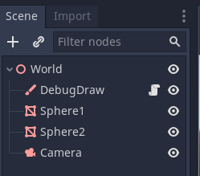
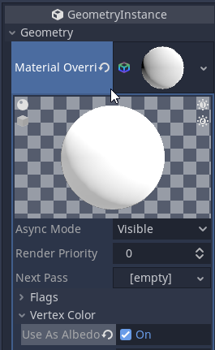

# Belajar Godot Engine 3 Mengenal Immediate Geometry

## Source Code Project Ini

https://github.com/rakifsul/belajar_coding_godot_3/tree/main/contoh_godot3_immediate_geometry

## Pendahuluan

Kali ini, kita akan belajar Immediate Geometry di Godot Engine 3.

Dengan Immediate Geometry, kita bisa menggambar vertex di ruang 3D.

Hal ini berguna ketika kita membuat sebuah karakter yang kompleks yang membutuhkan visualisasi dari komponen-komponen yang bekerja di belakang layar.

Sebagai contoh, jika Anda membuat NavMesh Agent dengan Godot Engine, maka karakter tersebut mungkin membutuhkan visualisasi dari path yang ditemukan.

Oleh karena itu, Immediate Geometry bisa dianggap cukup penting untuk visual debugging.

## Lebih Lanjut tentang Immediate Geometry

Dalam Godot Engine 3, Immediate Geometry adalah salah satu jenis node yang digunakan untuk merender geometri secara langsung dalam proses rendering.

### Berikut adalah penjelasan tentang Immediate Geometry

#### 1. Me-render Geometri Langsung

Immediate Geometry memungkinkan pengguna untuk merender geometri langsung ke dalam proses rendering tanpa menggunakan mesh terlebih dahulu.

Ini berguna untuk merender objek sederhana atau efek visual dengan cepat dan efisien.

#### 2. Memberi Fleksibilitas dan Kinerja

Immediate Geometry memberikan fleksibilitas dalam merender geometri dalam situasi di mana pembuatan dan manipulasi mesh secara dinamis tidak diperlukan.

Ini juga memungkinkan untuk meningkatkan kinerja karena menghindari overhead yang terkait dengan penggunaan mesh.

#### 3. Menggambar Primitif

Dengan Immediate Geometry, pengguna dapat menggambar berbagai primitif geometris seperti titik, garis, persegi, persegi panjang, dan segitiga langsung ke dalam proses rendering.

Ini memungkinkan untuk membuat efek visual yang beragam tanpa kompleksitas pembuatan mesh.

#### 4. Memanipulasi Geometri

Immediate Geometry memungkinkan untuk memanipulasi geometri secara langsung, seperti mengubah posisi, rotasi, skala, dan warna objek.

Ini memungkinkan untuk membuat efek animasi dan visualisasi yang dinamis tanpa perlu mengubah mesh atau menggunakan animasi kompleks.

#### 5. Sering Digunakan dalam Efek Visual dan Debugging

Immediate Geometry sering digunakan dalam pembuatan efek visual seperti efek partikel, cahaya, atau efek shader.

Ini juga berguna dalam debugging karena memungkinkan untuk dengan cepat merender informasi tambahan seperti garis debug atau area interaktif.

#### 6. Memiliki Keterbatasan pada Kompleksitas Geometri

Meskipun Immediate Geometry berguna untuk merender geometri sederhana secara langsung, namun tidak cocok untuk geometri yang kompleks atau detail karena keterbatasan kinerja dan kemampuan manipulasi.

### Manfaat Immediate Geometry di Godot Engine 3

#### 1. Memberikan Kinerja yang Cepat

Immediate Geometry memberikan kinerja yang cepat untuk merender geometri sederhana atau efek visual tanpa overhead yang terkait dengan penggunaan mesh.

#### 2. Memberi Fleksibilitas dan Kreativitas

Pengguna dapat dengan mudah menciptakan efek visual yang beragam dan dinamis dengan menggunakan Immediate Geometry tanpa batasan kompleksitas pembuatan mesh.

#### 3. Berguna dalam Efek Visual dan Debugging

Immediate Geometry sangat berguna dalam pembuatan efek visual dan debugging karena fleksibilitasnya dalam merender geometri langsung ke dalam proses rendering.

Dengan memahami konsep dan manfaat Immediate Geometry, pengguna Godot Engine 3 dapat menggunakan node ini untuk menciptakan berbagai efek visual dan geometri sederhana dengan cepat dan efisien dalam proses pengembangan permainan dan aplikasi.

## Tujuan

Tujuan dari tutorial ini adalah:

-   Pembaca mengenal Immediate Geometry dan dapat menggambar vertex dengannya.

## Prasyarat

Prasyarat dari tutorial ini adalah:

-   Menggunakan Godot Engine 3
-   Pernah coding sebelumnya
-   Pernah belajar materi matematika untuk 3D game development
-   Mengetahui dasar-dasar Godot Engine 3 untuk 3D.

## Langkah-Langkah

Pertama, buatlah project baru.

Caranya telah dibahas di sini.

Selanjutnya, buat Spatial bernama World, kemudian save as "World.tscn".

Jadi, sekarang Anda punya satu scene bernama "World.tscn".

Pindahkan Scene tersebut ke dalam folder "Scenes".

Jadi posisinya sekarang di "Scenes/World.tscn".

Lalu, buat child Node seperti di gambar di bawah ini:



Penjelasan:

-   DebugDraw adalah ImmediateGeometry
-   Sphere1 adalah MeshInstance dengan Mesh berupa Sphere
-   Sphere2 adalah MeshInstance dengan Mesh berupa Sphere
-   Camera adalah Camera

Selanjutnya, sorot DebugDraw dan lihat inspectornya.

Di sana, buat Material Override, dan buat New Spatial Material.

Kemudian set sesuai gambar di bawah ini:



Selanjutnya, buat script "Scripts/WorldDebugDraw.gd" dan isi dengan kode ini:

```
# file: WorldDebugDraw.gd

# extend script ini dari ImmediateGeometry
extends ImmediateGeometry

# ambil referensi dari Node
onready var sphere_1 = get_node("../Sphere1")
onready var sphere_2 = get_node("../Sphere2")

# abaikan
func _ready():
    pass

# pada setiap frame. delta adalah selisih waktu antar frame
func _process(delta):
    # kita mengambil posisi masing-masing sphere dengan global_transform.origin
    var pos_1 = sphere_1.global_transform.origin
    var pos_2 = sphere_2.global_transform.origin

    # begin: menggambar garis
    begin(Mesh.PRIMITIVE_LINE_STRIP)

    set_color(Color.red)
    add_vertex(pos_1)
    add_vertex(pos_2)

    end()
    # end: menggambar garis

    # begin: menggambar sphere tambahan berwarna kuning
    begin(Mesh.PRIMITIVE_TRIANGLES)
    set_color(Color.yellow)
    add_sphere(40,40,5, false)

    end()
    # end: menggambar sphere tambahan berwarna kuning
```

Kemudian, attach script di atas ke scene "World/DebugDraw".

Selanjutnya, mainkan scene tersebut.

Nanti akan muncul objek 3 bola dan 1 garis.

## Pembahasan

Sekarang, lupakan 2 bola abu-abunya.

Itu dibuat tanpa Immediate Geometry.

Yang perlu Anda perhatikan adalah garis dan bola kuningnya.

Itu karena kedua objek tersebut digambar dengan Immediate Geometry.

Untuk penjelasannya, lihat kode ini:

```
# extend script ini dari ImmediateGeometry
extends ImmediateGeometry

# ambil referensi dari Node
onready var sphere_1 = get_node("../Sphere1")
onready var sphere_2 = get_node("../Sphere2")
```

Pertama, kode di atas meng-extend script dari ImmediateGeometry.

Wajar, karena DebugDraw aslinya adalah ImmediateGeometry, kemudian di-rename namanya jadi DebugDraw.

Selanjutnya, dapatkan referensi ke kedua Node MeshInstance sesuai kode di atas.

Lalu, kita gambar bola kuning dan garis di tiap frame:

```
# pada setiap frame. delta adalah selisih waktu antar frame
func _process(delta):
    # kita mengambil posisi masing-masing sphere dengan global_transform.origin
    var pos_1 = sphere_1.global_transform.origin
    var pos_2 = sphere_2.global_transform.origin

    # begin: menggambar garis
    begin(Mesh.PRIMITIVE_LINE_STRIP)

    set_color(Color.red)
    add_vertex(pos_1)
    add_vertex(pos_2)

    end()
    # end: menggambar garis

    # begin: menggambar sphere tambahan berwarna kuning
    begin(Mesh.PRIMITIVE_TRIANGLES)
    set_color(Color.yellow)
    add_sphere(40,40,5, false)

    end()
    # end: menggambar sphere tambahan berwarna kuning
```

Sisanya, baca komentar kode dan pikirkan.

## Penutup

Sekarang, seharusnya Anda sudah paham tentang ImmediateGeometry.

Selanjutnya, silakan praktekkan sendiri.
