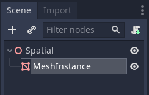
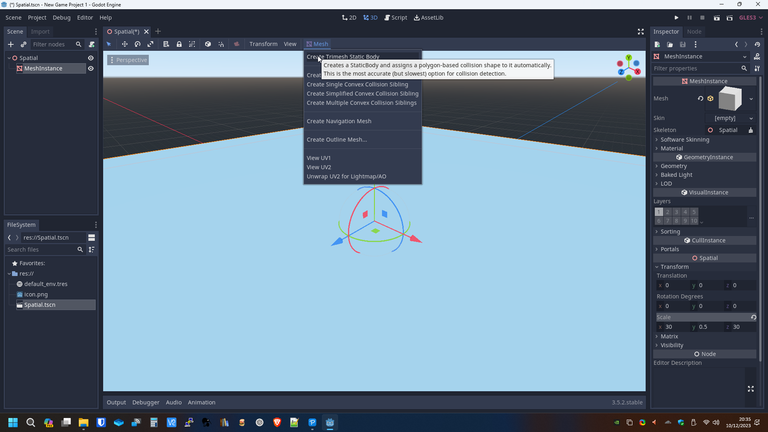
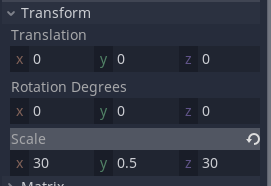
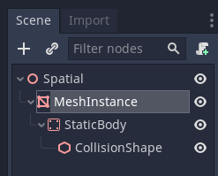
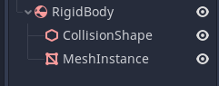
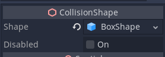
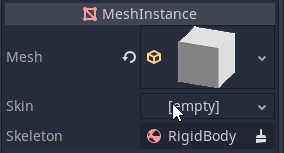
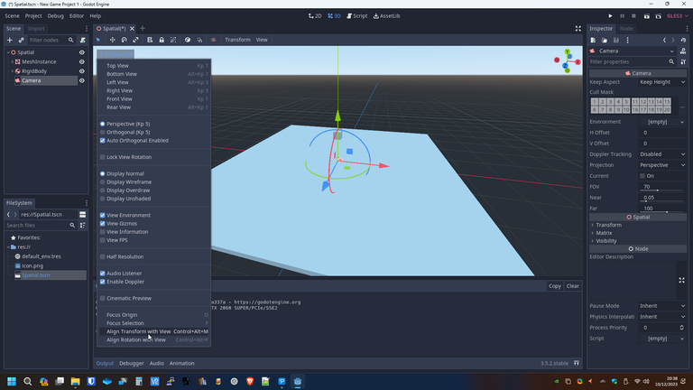

# Belajar Godot Engine 3 Mengenal Static Body

## Source Code Project Ini

https://github.com/rakifsul/belajar_coding_godot_3/tree/main/contoh_godot3_static_body

## Pendahuluan

Static Body adalah sebuah Node di Godot Engine 3 yang berguna sebagai penghalang.

Static Body tidak seperti Rigid Body yang dipengaruhi gaya.

Static Body, sesuai namanya, tetap statis jika berbenturan dengan objek lain.

Karena statis, Static Body cocok digunakan sebagai ground atau wall.

Dalam menjelaskan perilaku static body, diperlukan Rigid Body sebagai penyertanya yang akan dibahas ke depan.

## Lebih Lanjut tentang Static Body

Dalam Godot Engine, StaticBody adalah salah satu tipe body dalam sistem fisika yang digunakan untuk objek yang tidak bergerak atau memiliki perubahan posisi yang sangat terbatas.

Ini biasanya digunakan untuk elemen-elemen dalam dunia permainan yang tidak memerlukan respons terhadap gaya atau daya yang diterapkan.

Berbeda dengan jenis body lainnya seperti KinematicBody atau RigidBody, StaticBody tidak merespons terhadap gaya atau impuls, membuatnya ideal untuk objek-objek seperti dinding, lantai, atau objek yang tidak berubah.

### Karakteristik Utama Static Body

#### Tidak Bergerak

StaticBody dirancang untuk objek-objek yang tetap atau tidak bergerak dalam ruang game.
Ketika Anda menetapkan objek sebagai StaticBody, ia tidak akan terpengaruh oleh gaya, impuls, atau gaya gravitasi.

#### Tidak Merespons terhadap Gaya atau Impuls

Sebagai lawan dari RigidBody yang merespons secara penuh terhadap gaya dan impuls, StaticBody tidak akan mengalami perubahan kecepatan atau gerakan sehubungan dengan gaya eksternal.

#### Ideal untuk Lingkungan Statis

StaticBody sangat berguna untuk mewakili elemen-elemen statis dalam lingkungan game seperti dinding, lantai, langit-langit, atau objek lain yang tidak berubah.

#### Penanganan Benturan

Meskipun StaticBody tidak bergerak, ia tetap menangani deteksi benturan dengan objek lain dalam dunia game.
Ini berarti Anda dapat menggunakan StaticBody untuk menentukan batas-batas atau permukaan-permukaan yang tidak dapat ditembus oleh objek lain.

#### Ringan secara Komputasi

Dibandingkan dengan RigidBody yang memerlukan perhitungan fisika lebih intensif, penggunaan StaticBody seringkali lebih ringan secara komputasi karena tidak ada perhitungan dinamis yang terlibat.

### Cara Menggunakan Static Body di Godot Engine

Penggunaan StaticBody dalam Godot Engine melibatkan beberapa langkah dasar:

#### Menambahkan StaticBody ke Scene

Buka editor Godot dan buka scene yang ingin Anda tambahkan StaticBody-nya.
Tambahkan StaticBody ke scene menggunakan menu atau toolbar Godot.

#### Menetapkan Bentuk Kollisi (Collision Shape)

Setelah menambahkan StaticBody, Anda perlu menetapkan bentuk kollision yang sesuai. Bentuk kollision akan digunakan untuk mendeteksi benturan dengan objek lain.
Pilih StaticBody di panel hierarki dan tambahkan bentuk kollision melalui editor Godot.

#### Konfigurasi Sifat-sifat

Atur sifat-sifat StaticBody sesuai kebutuhan Anda. Ini termasuk pengaturan massa (meskipun massa tidak berpengaruh pada objek statis), friksi, dan sifat-sifat lainnya.

#### Pengaturan Properti Visual (Opsional)

Meskipun StaticBody sendiri tidak terlihat dalam game (karena itu adalah objek tanpa perubahan visual), Anda mungkin memiliki model visual atau elemen visual terkait yang ingin Anda hubungkan dengan StaticBody. Anda dapat menambahkan model atau elemen visual ini ke bawah StaticBody sebagai child node.

#### Simulasi dan Pengujian

Jalankan simulasi atau tes game Anda untuk memastikan bahwa StaticBody berfungsi seperti yang diinginkan. Pastikan bahwa objek yang bergerak dapat berinteraksi dengan StaticBody sesuai dengan aturan kollisi yang telah Anda tetapkan.

### Contoh Penggunaan Static Body

Contoh umum penggunaan StaticBody termasuk:

#### Dinding dan Batas-Batas

Menetapkan dinding atau batas-batas level game sebagai StaticBody, sehingga objek-objek yang bergerak dapat berinteraksi dan bertabrakan dengan mereka.

#### Lantai dan Platform Statis

Mewakili lantai atau platform yang tidak bergerak sebagai StaticBody, sehingga karakter atau objek lain dapat berdiri atau bergerak di atasnya.

#### Elemen-elemen Lingkungan Tetap

Menetapkan elemen-elemen lingkungan yang tidak berubah seperti batu besar, pohon, atau elemen tetap lainnya sebagai StaticBody.

#### Objek-objek Tanpa Gerakan

Jika ada objek dalam game yang seharusnya tidak bergerak, seperti dekorasi latar belakang, patung, atau elemen tetap lainnya, Anda dapat menjadikannya StaticBody.
StaticBody dalam Godot Engine adalah komponen yang sangat berguna untuk merepresentasikan objek-objek statis dalam dunia game.

Dengan sifatnya yang tidak bergerak dan tidak merespons terhadap gaya atau impuls, StaticBody memainkan peran penting dalam mendefinisikan lingkungan dan batas-batas level game.

Penggunaannya yang sederhana dan efisien membuatnya menjadi pilihan yang baik untuk objek-objek dalam game yang memerlukan kestabilan dan ketidakbergerakan.

## Tujuan

Tujuan dari tutorial ini adalah:

-   Pembaca mengenal Static Body dan dapat menggunakannya dalam project Godot Engine 3.

## Prasyarat

Prasyarat dari tutorial ini adalah:

-   Menggunakan Godot Engine 3
-   Pernah coding sebelumnya
-   Mengetahui dasar-dasar Godot Engine 3 untuk 3D.

## Langkah-Langkah

Pertama, buatlah project baru.

Caranya telah dibahas di "[Belajar Godot Engine 3 Cara Membuat Project](https://github.com/rakifsul/belajar_coding_godot_3/tree/main/Belajar-Godot-Engine-3-Cara-Membuat-Project.md)".

Selanjutnya, buat scene baru bernama "Spatial.tscn" dengan root Spatial Node.

Save, kemudian tambahkan sebuah Mesh Instance Node di bawah Spatial Node tadi.

Dari property Mesh Instance di sebelah kanan, buat instance-nya berupa Cube.

Selanjutnya, kita akan mengkonversi Mesh Instance menjadi Tri Mesh Static Body.

Atau yang bisa disebut juga Static Body dengan Collision Shape berupa triangle mesh.

Caranya, sorot Mesh Instance, kemudian di toolbar "Mesh" klik dan pilih "Create Trimesh Static Body".

Kemudian transform Mesh Instance menjadi:

Hasilnya di cabangnya akan seperti ini:

Selanjutnya, kita akan membuat objek Rigid Body-nya.

Caranya sorot "Spatial", kemudian tambahkan Node Rigid Body.

Buat strukturnya seperti ini:

Collision Shape nya berupa Box:

Mesh Instance-nya berupa Cube:

Kemudian, transform Rigid Body tersebut sedikit ke atas lantainya, agar jika jatuh bisa terlihat jelas.

Selanjutnya, buat Camera di bawah Spatial.

Selanjutnya, navigasi 3D editor agar seluruh objek terlihat jelas.

Sorot Camera, kemudian di toolbar "Perspective" pilih "Align Transform with View".

Selanjutnya, jalankan "Scene.tscn", jika belum dipilih sebagai default scene, maka pilihlah scene tersebut.

Nanti dari layar akan tampil Cube jatuh dan tertahan Static Body di bawahnya.

## Pembahasan

Apa yang terjadi barusan adalah, kita memiliki 2 jenis komponen fisika yang ada di Godot Engine 3.

Itu adalah Static Body dan Rigid Body.

Static Body adalah lantainya dan Rigid Body adalah Cube yang jatuh dari atas lantai.

Tampak bahwa saat Rigid Body bersentuhan dengan Static Body, Static Body tidak terpengaruh sama sekali.

Sementara itu, Rigid Body tertahan olehnya.

Dengan kata lain, Static Body bisa menahan gerakan Rigid Body tetapi tidak terpengaruh oleh gaya di sekitarnya.

## Penutup

Sekarang, seharusnya Anda sudah paham tentang Static Body dan sedikit tentang Rigid Body dan interaksi antara keduanya.

Selanjutnya, silakan praktekkan sendiri.
