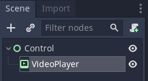
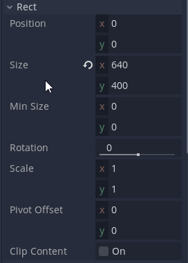
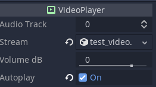
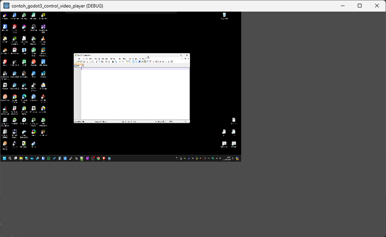

# Belajar Godot Engine 3 Mengenal VideoPlayer Node

## Source Code Project Ini

https://github.com/rakifsul/belajar_coding_godot_3/tree/main/contoh_godot3_control_video_player

## Pendahuluan

Cutscene dalam suatu game sudah ada sejak dulu.

Itu biasa digunakan di awal permainan atau di antara level permainan, terutama pada game RPG, Action, maupun FPS.

Untuk menampilkan cutscene dengan Godot Engine, Anda mungkin memerlukan VideoPlayer Node.

Hal itu disebabkan oleh format file cutscene yang biasanya berformat video.

Bagaimana caranya? Mari kita coba.

## Lebih Lanjut tentang VideoPlayer Node

VideoPlayer Node di Godot Engine 3 adalah kontrol untuk memutar aliran video menggunakan sumber daya VideoStream.

Format video yang didukung termasuk WebM (.webm, VideoStreamWebm), Ogg Theora (.ogv, VideoStreamTheora), dan format apa pun yang diungkapkan melalui plugin GDNative menggunakan VideoStreamGDNative.

Berikut adalah beberapa fitur utama dari VideoPlayer Node:

-   Pemutaran Video: Memungkinkan pemutaran aliran video.
-   Format yang Didukung: Mendukung format WebM, Ogg Theora, dan format lain melalui GDNative.
-   Kontrol Audio: Anda dapat memilih trek audio yang akan diputar.
-   Autoplay: Memiliki opsi untuk memulai pemutaran secara otomatis saat adegan dimuat.
-   Penyesuaian Ukuran: Video dapat diskalakan untuk cocok dengan ukuran kontrol atau kontrol dapat disesuaikan untuk cocok dengan dimensi aliran video.
-   Pemutaran Terhenti: Memungkinkan video untuk dipause dan dilanjutkan.
-   Volume: Kontrol volume audio tersedia.

## Tujuan

Tujuan dari tutorial ini adalah:

-   Pembaca mengenal TextEdit Node.
-   Pembaca mampu mencoba menggunakan TextEdit Node.

## Prasyarat

Prasyarat dari tutorial ini adalah:

-   Menggunakan Godot Engine 3
-   Pernah coding sebelumnya
-   Mengetahui dasar-dasar Godot Engine 3.

## Langkah-Langkah

Pertama, buatlah project baru.

Caranya telah dibahas di sini.

Selanjutnya, buat scene baru bernama "Control.tscn" dengan root Control Node.

Selanjutnya, buat VideoPlayer Node di bawah Control Node tersebut:

Di inspector VideoPlayer Node, buka Rect dan isi seperti ini:

Download file video berformat .webm dari suatu tempat, kemudian drag and drop ke dalam resource Godot Engine.

Selanjutnya, muat file tersebut ke dalam VideoPlayer Node inspector, dan juga centang autoplay:

Jadikan Control.tscn sebagai scene default, kemudian jalankan.

Hasilnya seperti ini:

Di pojok kiri atas, ada objek VideoPlayer.

Di sana Anda bisa menonton video .webm yang Anda pasang sebelumnya.

Kira-kira demikian.

## Pembahasan

Tidak ada pembahasan yang diperlukan di artikel ini.

## Penutup

Saya kira cukup sekian.

Jika Anda ingin menggunakan file video saya, sudah saya sediakan di folder project-nya.
