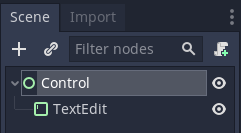
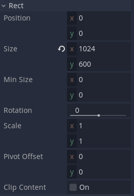
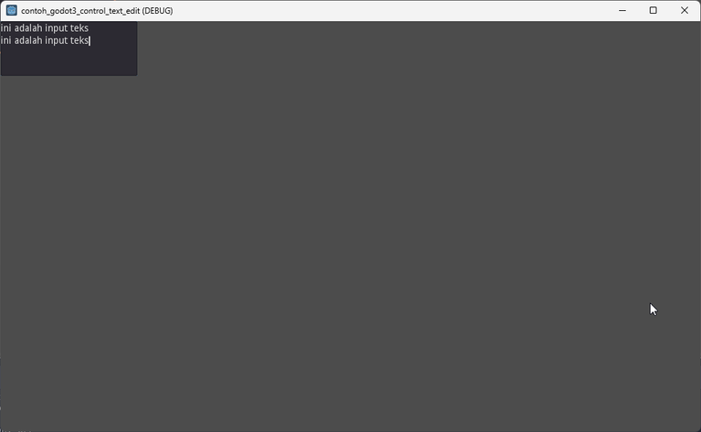

# Belajar Godot Engine 3 Menggunakan TextEdit Node

## Source Code Project Ini

https://github.com/rakifsul/belajar_coding_godot_3/tree/main/contoh_godot3_control_text_edit

## Pendahuluan

Input teks dalam game sudah umum diterapkan.

Di Godot Engine 3, input teks bisa dibuat dengan TextEdit Node.

Bagaimana caranya? Mari kita coba.

## Lebih Lanjut tentang TextEdit Node

TextEdit Node di Godot Engine 3 adalah sebuah komponen yang memungkinkan pengguna untuk mengedit teks dalam beberapa baris.

Ini memiliki fasilitas terbatas untuk mengedit kode, seperti dukungan penyorotan sintaks.

Berikut adalah beberapa fitur utama dari TextEdit Node:

-   Penyorotan Sintaks: Mendukung penyorotan sintaks dasar.
-   Pengeditan Multibaris: Memungkinkan pengguna untuk mengedit teks yang panjang dan terdiri dari beberapa baris.
-   Kontrol Kursor: Memiliki opsi untuk mengontrol perilaku kursor seperti berkedip.
-   Pilihan Teks: Memungkinkan pemilihan teks dan operasi salin-tempel.
-   Undo dan Redo: Mendukung fungsi undo dan redo untuk mengedit teks.

## Tujuan

Tujuan dari tutorial ini adalah:

-   Pembaca mengenal TextEdit Node.
-   Pembaca mampu mencoba menggunakan TextEdit Node.

## Prasyarat

Prasyarat dari tutorial ini adalah:

-   Menggunakan Godot Engine 3
-   Pernah coding sebelumnya
-   Mengetahui dasar-dasar Godot Engine 3.

## Langkah-Langkah

Pertama, buatlah project baru.

Caranya telah dibahas di "[Belajar Godot Engine 3 Cara Membuat Project](https://github.com/rakifsul/belajar_coding_godot_3/tree/main/Belajar-Godot-Engine-3-Cara-Membuat-Project.md)".

Selanjutnya, buat scene baru bernama "Control.tscn" dengan root Control Node.

Selanjutnya, buat TextEdit Node di bawah Control Node tersebut:

Di inspector TextEdit Node, buka Rect dan isi seperti ini:

Jadikan Control.tscn sebagai scene default, kemudian jalankan.

Hasilnya seperti ini:

Di pojok kiri atas, ada objek TextEdit.

Di sana Anda bisa mengisinya dengan teks saat game berjalan.

Kira-kira demikian.

## Pembahasan

Tidak ada pembahasan yang diperlukan di artikel ini.

## Penutup

Saya kira cukup sekian.
